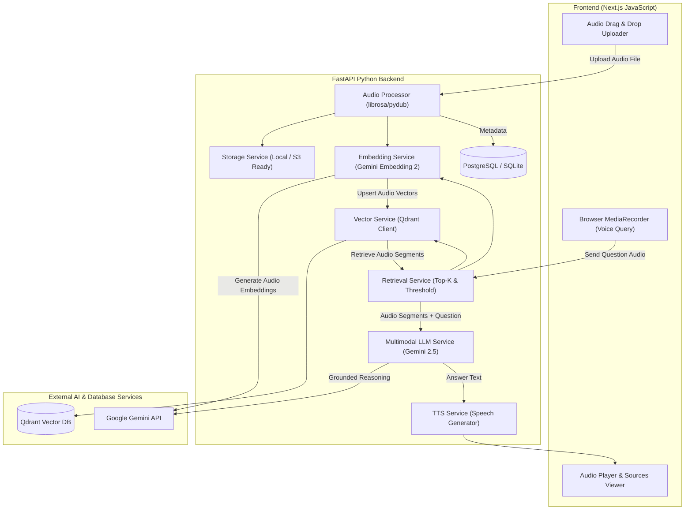

# VoiceRAG — Native Multimodal Audio RAG

[](https://opensource.org/licenses/MIT)
[-black)](https://nextjs.org/)
[-009688)](https://fastapi.tiangolo.com/)
[](https://qdrant.tech/)
[](https://ai.google.dev/)

**VoiceRAG** is a production-quality AI application designed for **Native Multimodal Audio Retrieval-Augmented Generation**. Unlike conventional audio QA systems that rely on intermediate text transcripts (`Audio → ASR → Transcript → Text Embedding → Text Search`), VoiceRAG operates directly on raw audio embeddings and dense vector search (`Audio → Audio Embedding → Vector DB → Multimodal LLM → Spoken Answer`).

---

## 🏗️ Architecture

### Native Ingestion Pipeline
```text
Knowledge Audio File (MP3/WAV/M4A/FLAC/OGG)
                     ↓
        Audio Preprocessing (Mono, 16kHz WAV)
                     ↓
         Chunking (30s window, 5s overlap)
                     ↓
             Gemini Embedding 2
                     ↓
             Audio Vectors (768-dim)
                     ↓
            Qdrant Vector Database
```

### Native Spoken Question Retrieval & Answering Pipeline
```text
               User Voice Question
                        ↓
                Gemini Embedding 2
                        ↓
                   Query Vector
                        ↓
            Qdrant Vector Similarity Search
                        ↓
            Top-K Relevant Audio Chunks
                        ↓
  Grounded Multimodal Gemini LLM (Strict Prompting)
                        ↓
                   Answer Text
                        ↓
             Speech Synthesis (TTS)
                        ↓
                🔊 Spoken Answer
```

### Mermaid Architecture Diagram



---

## ✨ Features

- **Zero-Transcript Vector Retrieval**: Transcripts are not used for retrieval. Audio content is vectorized directly via **Gemini Embedding 2**.
- **Dense Vector Search**: Powered by **Qdrant** with Cosine similarity metric and configurable vector dimensions.
- **Overlapping Audio Chunking**: Audio recordings are split into normalized 30-second windows with 5-second overlap, preserving start/end timestamps.
- **Strict Multimodal Grounding**: Multimodal Gemini receives the original question audio alongside retrieved audio segments. Hallucinations are prevented with strict fallback handling: *"I could not find enough information in the provided audio."*
- **Speech Synthesis (TTS)**: Generated answers are automatically converted into playable audio.
- **Segment Source Browser**: Interactive UI allows users to review and listen to exact timestamped knowledge audio chunks.
- **Pure JavaScript Next.js Frontend**: Clean Next.js App Router codebase built strictly with JavaScript (`.js` and `.jsx`).

---

## 🛠️ Technology Stack

- **Frontend**: Next.js 14, React 18, Tailwind CSS, Lucide Icons, JavaScript (ES6+), Browser `MediaRecorder` API.
- **Backend**: Python 3.10+, FastAPI, Uvicorn, Pydantic, SQLAlchemy, `google-genai` SDK, `qdrant-client`, `librosa`, `soundfile`, `pydub`, `numpy`, `gTTS`.
- **Database**: Qdrant Vector DB + PostgreSQL / SQLite metadata persistence.

---

## ⚙️ Environment Variables

Create `.env` in the root directory:

```env
# Google Gemini API Key
GEMINI_API_KEY=your_gemini_api_key_here

# Qdrant Vector Database Configuration
QDRANT_URL=http://localhost:6333
QDRANT_API_KEY=
QDRANT_COLLECTION=voicerag_audio

# Audio Embedding Configuration (Gemini Embedding 2 dimension)
EMBEDDING_DIMENSION=768

# RAG Retrieval Configuration
TOP_K=5
SIMILARITY_THRESHOLD=0.35

# Storage Configuration
STORAGE_PATH=./storage

# Database Configuration
DATABASE_URL=sqlite:///./storage/voicerag.db
```

---

## 🚀 Quick Start

### 1. Docker Compose (Qdrant & Backend)

```bash
docker compose up -d
```

### 2. Manual Backend Setup (FastAPI)

```bash
cd backend

# Create virtual environment
python -m venv venv

# Activate virtual environment
# Windows:
venv\Scripts\activate
# Linux/macOS:
# source venv/bin/activate

# Install dependencies
pip install -r requirements.txt

# Start FastAPI server
python run.py
```
The API server will run at `http://localhost:8000`.

### 3. Frontend Setup (Next.js)

```bash
cd frontend

# Install dependencies
npm install

# Start Next.js dev server
npm run dev
```
Open [http://localhost:3000](http://localhost:3000) in your browser.

---

## 🧪 Testing

Run automated tests for audio processor chunking, threshold evaluation, and API routes:

```bash
cd backend
pytest -v
```

---

## 📡 API Endpoints

| Method | Endpoint | Description |
| :--- | :--- | :--- |
| `POST` | `/api/audio/upload` | Ingests knowledge audio file (Chunking + Vector Indexing) |
| `GET` | `/api/audio/{file_id}/status` | Checks audio ingestion progress status |
| `POST` | `/api/query` | Spoken question multimodal RAG query |
| `GET` | `/api/audio/{file_id}` | Streams original knowledge audio file |
| `GET` | `/api/audio/chunks/{chunk_id}` | Streams specific retrieved audio chunk WAV file |
| `GET` | `/api/audio/tts/{filename}` | Streams synthesized spoken answer audio |
| `GET` | `/health` | Health check endpoint |

---

## 📁 Project Structure

```text
EchoRAG/
├── backend/
│   ├── app/
│   │   ├── api/
│   │   │   └── routes.py
│   │   ├── services/
│   │   │   ├── audio_processor.py
│   │   │   ├── embedding_service.py
│   │   │   ├── vector_service.py
│   │   │   ├── retrieval_service.py
│   │   │   ├── llm_service.py
│   │   │   ├── tts_service.py
│   │   │   └── storage_service.py
│   │   ├── config.py
│   │   ├── db.py
│   │   ├── models.py
│   │   └── main.py
│   ├── tests/
│   │   ├── test_audio_processor.py
│   │   ├── test_retrieval.py
│   │   └── test_api.py
│   ├── storage/
│   ├── Dockerfile
│   ├── requirements.txt
│   └── run.py
├── frontend/
│   ├── app/
│   │   ├── layout.js
│   │   ├── page.js
│   │   └── globals.css
│   ├── components/
│   │   ├── Header.jsx
│   │   ├── AudioUploader.jsx
│   │   ├── VoiceRecorder.jsx
│   │   ├── AnswerDisplay.jsx
│   │   ├── RetrievedSources.jsx
│   │   └── ConversationHistory.jsx
│   └── package.json
├── docker-compose.yml
├── .env.example
└── README.md
```

---

## 💡 Native Audio RAG vs. Transcript-Based RAG

| Dimension | Conventional ASR RAG | VoiceRAG (Native Audio RAG) |
| :--- | :--- | :--- |
| **Retrieval Key** | Text transcript embeddings | Raw Audio embeddings (Gemini Embedding 2) |
| **Noise & Pitch Resilience** | Sensitive to ASR mistranscriptions | Preserves acoustic, pitch, and prosodic cues |
| **Non-Verbal Signals** | Lost in transcription | Retained in audio vector representation |
| **Multimodal Inputs** | Converts text back to prompt | Feeds raw audio segments directly to Gemini LLM |

---

## 📌 Limitations & Future Improvements

- **Speaker Diarization**: Future releases will integrate speaker diarization to populate `speaker_id` in chunk payloads.
- **Voice Cloning**: `tts_service.py` is isolated to allow seamless drop-in replacement with voice-cloning synthesis models (e.g. ElevenLabs / CosyVoice).
- **Cloud Storage**: `storage_service.py` abstracts local file paths, allowing direct migration to S3 or Google Cloud Storage.

---

## 📄 License

MIT License
